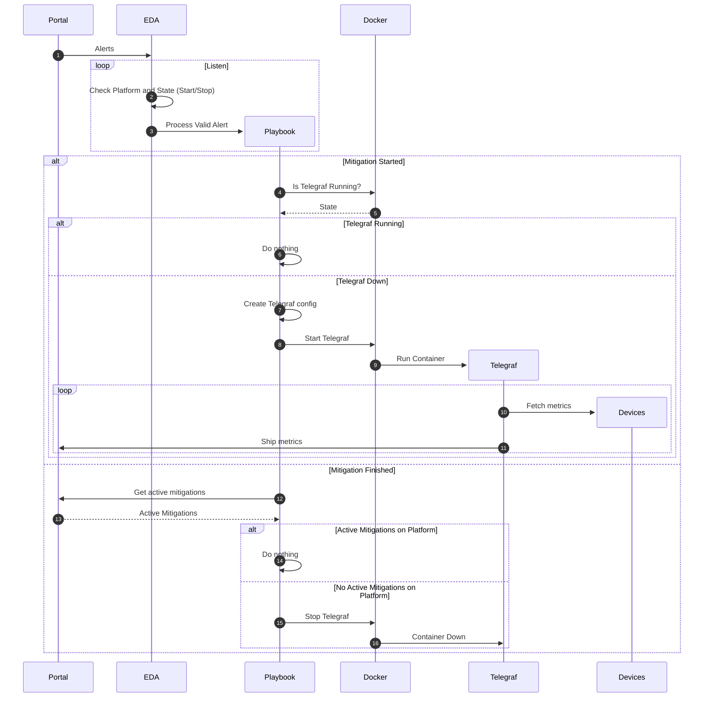

---
## Intro

In this post we will go through a detailed how to on executing Ansible playbooks triggered by a webhook notification event raised in Kentik Portal.  The use case is to have visibility into BGP Flowspec metrics of the devices during mitigations and see the relevant counters in the Portal under Kentik's NMS Metrics Explorer.

You may find all relevant files in my [repo](https://github.com/becos76/kentik-eda).

---
## The Intent

For the webhook receiver part, we are going to use [Kentik's ansible_eda](https://github.com/kentik/ansible_eda) collection that will _listen_ for a mitigation notification event. Once the event is received and a mitigation is started, EDA will trigger the execution of a playbook to handle the event and spin-up Telegraf in order to start polling the devices for BGP Flowspec streaming telemetry counters while reporting them back to the Portal in influx line format via HTTPS. 

Once the mitigation is over and EDA receives the respective _cease_ notification, a check for any active mitigations on the devices is done via Kentik's API and if there are no active mitigations on the devices, EDA will trigger Telegraf to stop.  If there are still on-going mitigations, Telegraf will continue to poll and ship metrics till we receive the last mitigation's notification.

---
## Lab Setup

Here is how the lab has been set-up for this:
- Two Cisco IOS XRv 9000 devices defined in the portal with established BGP sessions and Flowspec family enabled. GRPC is configured and enabled on the devices.
- A mitigation Platform defined in the Portal that includes both devices, and two mitigation methods attached. One will block ICMP echo-requests and the other will Rate Limit SSH protocol
- A notification channel of type JSON defined in the portal and attached to both mitigation methods I chose not to use any Alerting Policies with this and trigger all mitigations manually in order to speed things up 
- An Ubuntu VM (jammy) with docker installed
	- EDA will run inside a docker container with Traefik  _proxying_ the webhook events
	- Once an _actionable_ event is received, EDA will control a Telegraf docker container accordingly through a playbook

---
## Discovery

We will start by exploring what we see on the devices during a running flowspec mitigation. We have triggered two manual mitigations in the Portal and those are currently active on the devices:
```
RP/0/RP0/CPU0:ATH-POP1-XRV1#show flowspec afi-all detail

AFI: IPv4
  Flow           :Dest:10.10.10.11/32,ICMPType:=8
    Actions      :Traffic-rate: 0 bps  (bgp.1)
  Flow           :Source:10.10.10.12/32,Proto:=6,DPort:=22
    Actions      :Traffic-rate: 160000 bps  (bgp.1)
```
Unfortunatelly the XRv has a limited data plane, so we do not get any _action_ counters on the mitigations - this and also no netflow out of this virtual device :cry:. In case of a _real_ XR device the output would be similar to this:
```
REAL-XR#show flowspec afi-all detail

AFI: IPv4
  Flow           :Dest:10.10.10.11/32,ICMPType:=8
    Actions      :Traffic-rate: 0 bps  (bgp.1)
	Statisctics                       (packets/bytes)
	  Matched         :                       10/640
	  Dropped         :                       10/640
```



So we have two mitigations as expected. Let's find out which YANG model those are defined under. After trying some show commands for the xpath, there it is:
```
RP/0/RP0/CPU0:ATH-POP1-XRV1#schema-describe "show flowspec afi-all detail"

Action: get
Path:   RootCfg.ASNFormat

Action: get_children
Path:   RootOper.FlowSpec.VRF({'VRFName': 'default'}).AF

Action: get
Path:   RootOper.FlowSpec.VRF({'VRFName': 'default'}).AF({'AFName': 'IPv4'}).Flow

RP/0/RP0/CPU0:ATH-POP1-XRV1#show telemetry internal xpath "show flowspec afi-all detail"

Error: Invalid input
RP/0/RP0/CPU0:ATH-POP1-XRV1#show telemetry internal xpath "show flowspec afi-all"

Error: Invalid input
RP/0/RP0/CPU0:ATH-POP1-XRV1#show telemetry internal xpath "show flowspec summary"

Cisco-IOS-XR-flowspec-oper:flow-spec/summary

RP/0/RP0/CPU0:ATH-POP1-XRV1#show telemetry internal json Cisco-IOS-XR-flowspec-oper:flow-spec | include path

  "encoding_path": "Cisco-IOS-XR-flowspec-oper:flow-spec/vrfs/vrf/afs/af/flows/flow",
  "encoding_path": "Cisco-IOS-XR-flowspec-oper:flow-spec/vrfs/vrf/afs/af/nlris/nlri",
  "encoding_path": "Cisco-IOS-XR-flowspec-oper:flow-spec/vrfs/vrf/afs/af/table-summary",
  "encoding_path": "Cisco-IOS-XR-flowspec-oper:flow-spec/summary",
  "encoding_path": "Cisco-IOS-XR-flowspec-oper:flow-spec/clients/client",

```
Now we know the YANG model and the xpath, and we can get the metrics out of. We will test it with `gnmic` to see if it works and get the details of the tags/paths returned:
```json
❯ gnmic -a 10.12.255.1:57344 -u <device_username> -p <device_password> --skip-verify prompt
gnmic> get --path Cisco-IOS-XR-flowspec-oper:flow-spec/vrfs/vrf/afs/af/flows/flow -e json_ietf --format event
[
  {
    "name": "get-request",
    "timestamp": 1716762517741698080,
    "tags": {
      "af_af-name": "IPv4",
      "flow_flow-notation": "Dest:10.10.10.11/32,ICMPType:=8",
      "source": "10.12.255.1:57344",
      "vrf_vrf-name": "default"
    },
    "values": {
      "/Cisco-IOS-XR-flowspec-oper:/flow-spec/vrfs/vrf/afs/af/flows/flow/active-flow-client/action.0/dscp": 0,
      "/Cisco-IOS-XR-flowspec-oper:/flow-spec/vrfs/vrf/afs/af/flows/flow/active-flow-client/action.0/ipv4-nh": "0.0.0.0",
      "/Cisco-IOS-XR-flowspec-oper:/flow-spec/vrfs/vrf/afs/af/flows/flow/active-flow-client/action.0/ipv6-nh": "::",
      "/Cisco-IOS-XR-flowspec-oper:/flow-spec/vrfs/vrf/afs/af/flows/flow/active-flow-client/action.0/rate": "0",
      "/Cisco-IOS-XR-flowspec-oper:/flow-spec/vrfs/vrf/afs/af/flows/flow/flow-notation": "Dest:10.10.10.11/32,ICMPType:=8",
      "/Cisco-IOS-XR-flowspec-oper:/flow-spec/vrfs/vrf/afs/af/flows/flow/flow-statistics/classified/bytes": "0",
      "/Cisco-IOS-XR-flowspec-oper:/flow-spec/vrfs/vrf/afs/af/flows/flow/flow-statistics/classified/packets": "0",
      "/Cisco-IOS-XR-flowspec-oper:/flow-spec/vrfs/vrf/afs/af/flows/flow/flow-statistics/dropped/bytes": "0",
      "/Cisco-IOS-XR-flowspec-oper:/flow-spec/vrfs/vrf/afs/af/flows/flow/flow-statistics/dropped/packets": "0",
      "/Cisco-IOS-XR-flowspec-oper:/flow-spec/vrfs/vrf/afs/af/flows/flow/matches/destination-prefix-ipv4/mask": "255.255.255.255",
      "/Cisco-IOS-XR-flowspec-oper:/flow-spec/vrfs/vrf/afs/af/flows/flow/matches/destination-prefix-ipv4/prefix": "10.10.10.11",
      "/Cisco-IOS-XR-flowspec-oper:/flow-spec/vrfs/vrf/afs/af/flows/flow/matches/destination-prefix-ipv6/mask": 0,
      "/Cisco-IOS-XR-flowspec-oper:/flow-spec/vrfs/vrf/afs/af/flows/flow/matches/destination-prefix-ipv6/prefix": "::",
      "/Cisco-IOS-XR-flowspec-oper:/flow-spec/vrfs/vrf/afs/af/flows/flow/matches/icmp/code": 255,
      "/Cisco-IOS-XR-flowspec-oper:/flow-spec/vrfs/vrf/afs/af/flows/flow/matches/icmp/type": 8,
      "/Cisco-IOS-XR-flowspec-oper:/flow-spec/vrfs/vrf/afs/af/flows/flow/matches/source-prefix-ipv4/mask": "0.0.0.0",
      "/Cisco-IOS-XR-flowspec-oper:/flow-spec/vrfs/vrf/afs/af/flows/flow/matches/source-prefix-ipv4/prefix": "0.0.0.0",
      "/Cisco-IOS-XR-flowspec-oper:/flow-spec/vrfs/vrf/afs/af/flows/flow/matches/source-prefix-ipv6/mask": 0,
      "/Cisco-IOS-XR-flowspec-oper:/flow-spec/vrfs/vrf/afs/af/flows/flow/matches/source-prefix-ipv6/prefix": "::",
      "/Cisco-IOS-XR-flowspec-oper:/flow-spec/vrfs/vrf/afs/af/flows/flow/matches/tcp-flag/match-any": false,
      "/Cisco-IOS-XR-flowspec-oper:/flow-spec/vrfs/vrf/afs/af/flows/flow/matches/tcp-flag/value": 0
    }
  },
  {
    "name": "get-request",
    "timestamp": 1716762517741698080,
    "tags": {
      "af_af-name": "IPv4",
      "flow_flow-notation": "Source:10.10.10.12/32,Proto:=6,DPort:=22",
      "source": "10.12.255.1:57344",
      "vrf_vrf-name": "default"
    },
    "values": {
      "/Cisco-IOS-XR-flowspec-oper:/flow-spec/vrfs/vrf/afs/af/flows/flow/active-flow-client/action.0/dscp": 0,
      "/Cisco-IOS-XR-flowspec-oper:/flow-spec/vrfs/vrf/afs/af/flows/flow/active-flow-client/action.0/ipv4-nh": "0.0.0.0",
      "/Cisco-IOS-XR-flowspec-oper:/flow-spec/vrfs/vrf/afs/af/flows/flow/active-flow-client/action.0/ipv6-nh": "::",
      "/Cisco-IOS-XR-flowspec-oper:/flow-spec/vrfs/vrf/afs/af/flows/flow/active-flow-client/action.0/rate": "160000",
      "/Cisco-IOS-XR-flowspec-oper:/flow-spec/vrfs/vrf/afs/af/flows/flow/flow-notation": "Source:10.10.10.12/32,Proto:=6,DPort:=22",
      "/Cisco-IOS-XR-flowspec-oper:/flow-spec/vrfs/vrf/afs/af/flows/flow/flow-statistics/classified/bytes": "0",
      "/Cisco-IOS-XR-flowspec-oper:/flow-spec/vrfs/vrf/afs/af/flows/flow/flow-statistics/classified/packets": "0",
      "/Cisco-IOS-XR-flowspec-oper:/flow-spec/vrfs/vrf/afs/af/flows/flow/flow-statistics/dropped/bytes": "0",
      "/Cisco-IOS-XR-flowspec-oper:/flow-spec/vrfs/vrf/afs/af/flows/flow/flow-statistics/dropped/packets": "0",
      "/Cisco-IOS-XR-flowspec-oper:/flow-spec/vrfs/vrf/afs/af/flows/flow/matches/destination-port/uint16_rng_array.0/max": 22,
      "/Cisco-IOS-XR-flowspec-oper:/flow-spec/vrfs/vrf/afs/af/flows/flow/matches/destination-port/uint16_rng_array.0/min": 22,
      "/Cisco-IOS-XR-flowspec-oper:/flow-spec/vrfs/vrf/afs/af/flows/flow/matches/destination-prefix-ipv4/mask": "0.0.0.0",
      "/Cisco-IOS-XR-flowspec-oper:/flow-spec/vrfs/vrf/afs/af/flows/flow/matches/destination-prefix-ipv4/prefix": "0.0.0.0",
      "/Cisco-IOS-XR-flowspec-oper:/flow-spec/vrfs/vrf/afs/af/flows/flow/matches/destination-prefix-ipv6/mask": 0,
      "/Cisco-IOS-XR-flowspec-oper:/flow-spec/vrfs/vrf/afs/af/flows/flow/matches/destination-prefix-ipv6/prefix": "::",
      "/Cisco-IOS-XR-flowspec-oper:/flow-spec/vrfs/vrf/afs/af/flows/flow/matches/icmp/code": 0,
      "/Cisco-IOS-XR-flowspec-oper:/flow-spec/vrfs/vrf/afs/af/flows/flow/matches/icmp/type": 0,
      "/Cisco-IOS-XR-flowspec-oper:/flow-spec/vrfs/vrf/afs/af/flows/flow/matches/ip-protocol/uint16_rng_array.0/max": 6,
      "/Cisco-IOS-XR-flowspec-oper:/flow-spec/vrfs/vrf/afs/af/flows/flow/matches/ip-protocol/uint16_rng_array.0/min": 6,
      "/Cisco-IOS-XR-flowspec-oper:/flow-spec/vrfs/vrf/afs/af/flows/flow/matches/source-prefix-ipv4/mask": "255.255.255.255",
      "/Cisco-IOS-XR-flowspec-oper:/flow-spec/vrfs/vrf/afs/af/flows/flow/matches/source-prefix-ipv4/prefix": "10.10.10.12",
      "/Cisco-IOS-XR-flowspec-oper:/flow-spec/vrfs/vrf/afs/af/flows/flow/matches/source-prefix-ipv6/mask": 0,
      "/Cisco-IOS-XR-flowspec-oper:/flow-spec/vrfs/vrf/afs/af/flows/flow/matches/source-prefix-ipv6/prefix": "::",
      "/Cisco-IOS-XR-flowspec-oper:/flow-spec/vrfs/vrf/afs/af/flows/flow/matches/tcp-flag/match-any": false,
      "/Cisco-IOS-XR-flowspec-oper:/flow-spec/vrfs/vrf/afs/af/flows/flow/matches/tcp-flag/value": 0
    }
  }
]
```

---
## Kentik EDA

We are going to start off by explaining the file and folder structure giving a bit of info of how this works. The idea behind this is to have EDA running as a docker container. Traefik will handle reverse proxying the webhooks to EDA and in case a new mitigation is happening, then a telegraf docker container will spin up and start collecting gnmi metrics from the devices and pushing them to the Portal. Once the mitigation is over, EDA will receive the event to stop the mitigation.

Now, at this point, since more than one mitigations can be ongoing on the devices, we are going to focus on the specific mitigation Platform that will always include our devices. So any Method under the specific mitigation Platform will cause the start of the metrics collection.  Upon receiving a stop event on this Platform, we just have to make sure that this event is the _last_ one on the devices, and we can verify this via Kentik API requesting all active alerts in the portal of type Mitigation. If none exists, then we can assume that the event EDA received was the last one for the Platform.

In summary, here are the features delivered:
- Traefik is handling the proxying of webhooks to the appropriate path that Kentik EDA is set up to receive
- Kentik EDA processes only the relevant mitigation events coming in excluding the rest
- The playbook will dynamically produce the telegraf configuration file according to our defined variables in order to ship the metrics in the Portal

### Directory Structure

```Bash
.
├── docker-compose.yaml         >-- How to bring up our services
├── Dockerfile                  >-- How to build the EDA image
├── .env                        >-- Hidden file containing sensitive data to be passed as environment variables
├── .env.sample                 >-- Example env file
└── eda                         >-- EDA config folder to be mounted on the container
    ├── ansible.cfg             >-- Ansible configuration file picked up by default
    ├── ansible-inventory.yml   >-- Simple inv file including only localhost
    ├── eda_vars.yml            >-- Definition of the related variables used in the project
    ├── mitigation.yml          >-- Playbook to handle events received
    ├── rules.yml               >-- Rulebook defining our EDA logic
    └── telegraf                
        ├── telegraf.conf.j2    >-- Jinja2 template producing the configuration dynamically
        └── telegraf.conf       >-- Actual config to be used with the telegraf container
       
```

### Dockerfile

We are installing the dependencies and ansible needed collections for Kentik EDA to run. We are going to run everything under the `/app` directory inside the container

```Dockerfile
FROM quay.io/centos/centos:stream9-development

RUN dnf install -y java-17-openjdk-devel python3-pip gcc python3-devel postgresql-devel

ENV JAVA_HOME=/usr/lib/jvm/java-17-openjdk

RUN pip install -U pip \
    && pip install ansible-core \
    ansible-rulebook \
    ansible-runner \
    psycopg requests \
    && ansible-galaxy collection install kentik.ansible_eda community.docker

ARG APP_DIR=${APP_DIR:-/app}

WORKDIR $APP_DIR

RUN chmod -R 0775 $APP_DIR

```
### Compose

Our compose file will bring up two services. 
- **traefik**: that will listen for HTTP and will forward everything received at the `/eda` path to the EDA container replacing the path to `/alert`, since this is the path that Kentik EDA webhook listens on, and port `8080`. 
- **kentik-eda**: Our `eda` folder is mounted at the `/app` path inside the container, and contains all the files needed to run our logic. We also mount the docker unix socket to the container so that we can control the containers from within the EDA one. We also pass our variables to the container environment and we instruct the container to start the rulebook passing also the variables files. Security wise it is not the best to have a docker container controlling the host's containers by exposing the unix socket to it. :smile: 

```yaml
---
services:
  traefik:
    image: traefik
    container_name: traefik
    command: >
      --api.insecure=true
      --providers.docker
      --providers.docker.exposedbydefault=false
      --accesslog=true
      --entrypoints.eda.address=:80
      #--log.level=DEBUG
    ports:
      - 80:80
      - 8080:8080
    volumes:
      - /var/run/docker.sock:/var/run/docker.sock:ro
  kentik-eda:
    #scale: 2
    image: kentik-eda:0.1
    container_name: kentik-eda
    depends_on:
      - traefik
    build:
      context: .
    volumes:
      - ${PWD}/eda:/app
      - /var/run/docker.sock:/var/run/docker.sock:ro
    env_file:
      - .env
    ports:
      - 8080
    command: bash -c "ansible-rulebook --rulebook rules.yml -i ./ansible-inventory.yml --vars eda_vars.yml"
    labels:
      - "traefik.enable=true"
      - "traefik.http.routers.eda.rule=Host(`kentik.eda`) && Path(`/eda`)"
      - "traefik.http.routers.eda.middlewares=eda-ratelimit,eda-path"
      - "traefik.http.middlewares.eda-path.replacepath.path=/alert"
      - "traefik.http.middlewares.eda-ratelimit.ratelimit.average=10"
      - "traefik.http.middlewares.eda-ratelimit.ratelimit.burst=50"
      - "traefik.http.routers.eda.entrypoints=eda"
```
Here is the example `.env` file showing the variables needed to be exposed inside the EDA container environment:
```Bash
KENTIK_API_TOKEN=<your api token>
KENTIK_API_EMAIL=<your portal email>
KENTIK_API_ENDPOINT="https://grpc.api.kentik.eu/kmetrics/v202207/metrics/api/v2/write?bucket=&org=&precision=ns"
GRPC_USERNAME=<device username>
GRPC_PASSWORD=<device password>
```


We can bring everything up with `docker compose up --build`
```bash
❯ docker compose up --build --force-recreate --dry-run
[+] Building 0.0s (0/0)                                                                                  docker:default
[+] Running 5/0
 ✔ DRY-RUN MODE -    build service kentik-eda                                                                      0.0s
 ✔ DRY-RUN MODE -  ==> ==> writing image dryRun-648b28d83dd200d4e7709ac3a5d522f8244467bd                           0.0s
 ✔ DRY-RUN MODE -  ==> ==> naming to kentik-eda:0.1                                                                0.0s
 ✔ DRY-RUN MODE -  Container traefik                                                     Recreated                 0.0s
 ✔ DRY-RUN MODE -  Container kentik-eda                                                  Recreated                 0.0s
end of 'compose up' output, interactive run is not supported in dry-run mode
```
### Rulebook rules

Here is how we have configured our rules:
```YAML
---
- name: Listening for Webhook Events
  hosts: localhost
  sources:
    - kentik.ansible_eda.kentik_webhook:
        host: 0.0.0.0
        port: 8080
  rules:
    - name: R1 - New Event Received
      # If it is a valid start or stop mitigation event
      condition: event.payload is defined and
                 event.payload.CompanyID == vars.CompanyID and
                 event.payload.EventType == vars.EventType and
                 event.payload.MitigationPlatformID == vars.MitigationPlatformID and
                 event.payload.MitigationState in vars.ValidMitigationStates and
                 event.payload.MitigationStateNew in vars.ValidMitigationStates
      actions:
        - debug:
            msg: |
              New {{event.payload.MitigationType}}/{{event.payload.MitigationState}} event received
              ID: {{event.payload.MitigationID}}
              Platform: {{event.payload.MitigationPlatformName}}
              Method: {{event.payload.MitigationMethodName}}
              IP: {{event.payload.MitigationAlertIP}}

        # DEBUG:Dump the event
        #- print_event:
        #    pretty: true

        # Call the pb to handle the mitigation event
        - run_playbook:
            name: mitigation.yml

    # Catch and ignore the rest
    - name: R2 - Not taking action
      condition: event.meta is defined
      action:
        debug:
          msg:
            - "Ignoring {{event.payload.EventType}} event"

```
<p style="background-color:skyblue;text-align:center"><b>eda/rules.yml</b></p>
and our variables:

```YAML
---
CompanyID: <REDACTED>
EventType: "mitigation"
MitigationPlatformID: "257"
ValidMitigationStates:
    - "manualMitigating"
    - "mitigating"
    - "archived"
Mitigation:
    devices:
        - name: "ath-pop1-xrv1"
          ip: "10.12.255.1"
          port: 57344
        - name: "ath-pop1-xrv2"
          ip: "10.13.255.1"
          port: 57344
```
<p style="background-color:skyblue;text-align:center"><b>eda/eda_vars.yml</b></p>

As a condition we check the event payload against certain values in order to process it further, e.g. the CompanyID , the EventType and the MitigationPlatformID must match to what we have configured and also the EventState must be one of the _actionable_ states that we have defined in our dictionary. If we have a matching event then we pass control to the `mitigation.yml` playbook to handle the event further.

---
## Ansible Playbook

We could have had separate playbooks for the different states of the alerts received, i.e. separate conditions in the rules file, but we chose here to proceed with just one playbook to handle both cases.

A brief pseudocode of the playbook could be:
```Bash
#IF event state is 'mitigating'
	#IF Telegraf is not running
		- Generate telegraf config from template
		- Bring up the container
#ELSE IF event state is 'archived'
	#IF no active mitigation alerts in portal for PlatormID
		- Stop telegraf container
```





And here is the playbook. Two blocks were used to differentiate between the start and stop workflows. For the telegraf container the configuration file is dynamically produced through a jinja2 template and this is mounted within the container. This is achieved by specifying the full host path of the file, which is also relatively mounted within the EDA container, i.e. shared.

```YAML
---
- name: "::HANDLE MITIGATION EVENT::"
  gather_facts: no
  hosts: localhost
  vars_files: eda_vars.yml
  tasks:
    - name: START - NEW MITIGATION STARTING
      block: 
      
      - name: START::IS TELEGRAF RUNNING
        community.docker.docker_container_info:
          name: telegraf-eda
        register: result
     
      - name: START::GENERATE TELEGRAF CONFIG
        ansible.builtin.template:
          src: /app/telegraf/telegraf.conf.j2
          dest: /app/telegraf/telegraf.conf
        when: not result.exists|bool      
      
      - name: START::BRING UP CONTAINER
        community.docker.docker_container:
          name: telegraf-eda
          image: telegraf:latest
          state: started
          volumes:
            - "/opt/projects/kentik-eda/eda/telegraf/telegraf.conf:/etc/telegraf/telegraf.conf"
          env:
            KENTIK_API_EMAIL: "{{ lookup('ansible.builtin.env', 'KENTIK_API_EMAIL')}}"
            KENTIK_API_TOKEN: "{{ lookup('ansible.builtin.env', 'KENTIK_API_TOKEN')}}"
            GRPC_USERNAME: "{{ lookup('ansible.builtin.env', 'GRPC_USERNAME')}}"
            GRPC_PASSWORD: "{{ lookup('ansible.builtin.env', 'GRPC_PASSWORD')}}"
        when: not result.exists|bool      
      
      when: "'mitigating' in ansible_eda.event.payload.MitigationState|lower and 
            'mitigating' in ansible_eda.event.payload.MitigationStateNew|lower"
    
    - name: MITIGATION FINISHED
      block: 
      
      - name: STOP::GET ACTIVE ALERTS FROM KENTIK
        ansible.builtin.uri:
         url: https://api.kentik.eu/api/v5/alerts-active/alarms
         method: GET
         http_agent: ansible-eda-httpget
         headers:
           X-CH-Auth-API-Token: "{{ lookup('ansible.builtin.env', 'KENTIK_API_TOKEN')}}" 
           X-CH-Auth-Email: "{{ lookup('ansible.builtin.env', 'KENTIK_API_EMAIL')}}"
        register: alerts

      - name: STOP::CHECK KENTIK FOR ACTIVE MITIGATIONS
        ansible.builtin.debug: 
          msg: 
            - "Current Active Mitigations on Platform ID#{{MitigationPlatformID}}: {{alerts.json | 
               selectattr('mit_platform_id', 'match', ansible_eda.event.payload.MitigationPlatformID ) |
              selectattr('alarm_state', 'search', 'MITIGATING') | length}}"
                  
      - name: STOP::REMOVE TELEGRAF CONTAINER
        community.docker.docker_container:
          name: telegraf-eda
          state: absent

        when: alerts.json | 
              selectattr('mit_platform_id', 'match', ansible_eda.event.payload.MitigationPlatformID ) |
              selectattr('alarm_state', 'search', 'MITIGATING') | length == 0
      
      when: "'archived' in ansible_eda.event.payload.MitigationState|lower and
            'archived' in ansible_eda.event.payload.MitigationStateNew|lower"
```
<p style="background-color:skyblue;text-align:center"><b>eda/mitigation.yml</b></p>

### Telegraf configuration

When it comes to telegraf, we chose to have the config generated dynamically before the container starts. In this way we can:
- Specify the devices' attributes in the variables file and deduce the gnmi inputs from them
- Include the MitigationPlatformID as a tag along with all other event details
- Perform a _lookup_ to include DEVICE_IP and DEVICE_NAME along with the tags. This was implemented via an inline starlark script referencing a lookup dictionary that is dynamically constructed from our devices dictionary.
- All sensitive data are passed from the EDA container environment and instantiated via docker when the container is brought up.

Here is the template:
```toml
[agent]
  omit_hostname = true
  debug = true
  quiet = false

[global_tags]
  platform_id = "{{ MitigationPlatformID }}"

[[inputs.gnmi]]

  addresses = ["{{device.ip}}:{{device.port}}",]
  username = "${GRPC_USERNAME}"
  password = "${GRPC_PASSWORD}"
  redial = "10s"
  encoding = "proto"
  tls_enable = true
  insecure_skip_verify = true

[[inputs.gnmi.subscription]]
  name = "/devices/xrv9000/flowspec"
  origin = "Cisco-IOS-XR-flowspec-oper"
  path = "/flow-spec/vrfs/vrf/afs/af/flows/flow/flow-statistics/"
  subscription_mode = "sample"
  sample_interval = "30s"

[[processors.rename]]
  [[processors.rename.replace]]
    tag = "source"
    dest = "device_ip"

[[processors.override]]
  [processors.override.tagpass]
    vrf_name = [""]
  [processors.override.tags]
    vrf_name = "default"

[[processors.starlark]]
  source='''
lookup = {

  "{{ device.ip }}": "{{ device.name }}",
}
def apply(metric):
    if metric.tags['device_ip'] and metric.tags['device_ip'] in lookup:
       metric.tags['device_name'] = lookup[metric.tags['device_ip']]
    return metric
'''

[[outputs.file]]
  files = ["stdout"]
  data_format = "influx"
  influx_sort_fields = false
  tagexclude = ["path"]

[[outputs.http]]
  url = "{{ lookup('env', 'KENTIK_API_ENDPOINT')}}"
  data_format = "influx"
  influx_sort_fields = false
  tagexclude = ["path"]

  [outputs.http.headers]
    Content-Type = "application/influx"
    X-CH-Auth-Email = "${KENTIK_API_EMAIL}"
    X-CH-Auth-API-Token = "${KENTIK_API_TOKEN}"
```
<p style="background-color:skyblue;text-align:center"><b>eda/telegraf/telegraf.conf.j2</b></p>

And the respective config file produced to be picked up by docker:
```toml
[agent]
  omit_hostname = true
  debug = true
  quiet = false

[global_tags]
  platform_id = "257"

[[inputs.gnmi]]

  addresses = ["10.12.255.1:57344","10.13.255.1:57344"]
  username = "${GRPC_USERNAME}"
  password = "${GRPC_PASSWORD}"
  redial = "10s"
  encoding = "proto"
  tls_enable = true
  insecure_skip_verify = true

[[inputs.gnmi.subscription]]
  name = "/devices/xrv9000/flowspec"
  origin = "Cisco-IOS-XR-flowspec-oper"
  path = "/flow-spec/vrfs/vrf/afs/af/flows/flow/flow-statistics/"
  subscription_mode = "sample"
  sample_interval = "30s"

[[processors.rename]]
  [[processors.rename.replace]]
    tag = "source"
    dest = "device_ip"

[[processors.override]]
  [processors.override.tagpass]
    vrf_name = [""]
  [processors.override.tags]
    vrf_name = "default"

[[processors.starlark]]
  source='''
lookup = {
  "10.12.255.1": "ath-pop1-xrv1",
  "10.13.255.1": "ath-pop1-xrv2",
}
def apply(metric):
    if metric.tags['device_ip'] and metric.tags['device_ip'] in lookup:
       metric.tags['device_name'] = lookup[metric.tags['device_ip']]
    return metric
'''

[[outputs.file]]
  files = ["stdout"]
  data_format = "influx"
  influx_sort_fields = false
  tagexclude = ["path"]

[[outputs.http]]
  url = "https://grpc.api.kentik.eu/kmetrics/v202207/metrics/api/v2/write?bucket=&org=&precision=ns"
  data_format = "influx"
  influx_sort_fields = false
  tagexclude = ["path"]

  [outputs.http.headers]
    Content-Type = "application/influx"
    X-CH-Auth-Email = "${KENTIK_API_EMAIL}"
    X-CH-Auth-API-Token = "${KENTIK_API_TOKEN}"
```
<p style="background-color:skyblue;text-align:center"><b>eda/telegraf/telegraf.conf</b></p>

---
## Moment of Truth

After starting some manual mitigations, telegraf will ship the gnmi metrics to the Portal and those will be available under the `/devices/xrv9000/flowspec` custom schema path based on our configuration in the [`telegraf.conf`](#telegraf-configuration)file.

Here is how it looks like in the Metrics Explorer


Here are some console outputs from EDA running:

```Ansible
** 2024-05-26 16:00:04.559137 [debug] ******************************************
Ignoring mitigation event
********************************************************************************

** 2024-05-26 16:00:18.406938 [debug] ******************************************
New manual/manualMitigating event received
ID: 10108
Platform: XR-FlowSpec
Method: Discard ICMP echo-request
IP: 10.10.10.11/32
********************************************************************************

PLAY [::HANDLE MITIGATION EVENT::] *********************************************

TASK [START::IS TELEGRAF RUNNING] **********************************************
ok: [localhost]

TASK [START::GENERATE TELEGRAF CONFIG] *****************************************
ok: [localhost]

TASK [START::BRING UP CONTAINER] ***********************************************
changed: [localhost]

TASK [STOP::GET ACTIVE ALERTS FROM KENTIK] *************************************
skipping: [localhost]

TASK [STOP::CHECK KENTIK FOR ACTIVE MITIGATIONS] *******************************
skipping: [localhost]

TASK [STOP::REMOVE TELEGRAF CONTAINER] *****************************************
skipping: [localhost]

PLAY RECAP *********************************************************************
localhost                  : ok=3    changed=1    unreachable=0    failed=0    skipped=3    rescued=0    ignored=0
```
<p style="background-color:skyblue;text-align:center"><b>New mitigation</b></p>

```Ansible
** 2024-05-26 16:10:20.682550 [debug] ******************************************
New manual/archived event received
ID: 10111
Platform: XR-FlowSpec
Method: Rate Limit 20k TCP SSH
IP: 10.10.10.15/32
********************************************************************************

PLAY [::HANDLE MITIGATION EVENT::] *********************************************

TASK [START::IS TELEGRAF RUNNING] **********************************************
skipping: [localhost]

TASK [START::GENERATE TELEGRAF CONFIG] *****************************************
skipping: [localhost]

TASK [START::BRING UP CONTAINER] ***********************************************
skipping: [localhost]

TASK [STOP::GET ACTIVE ALERTS FROM KENTIK] *************************************
ok: [localhost]

TASK [STOP::CHECK KENTIK FOR ACTIVE MITIGATIONS] *******************************
ok: [localhost] => {
    "msg": [
        "Current Active Mitigations on Platform ID#257: 3"
    ]
}

TASK [STOP::REMOVE TELEGRAF CONTAINER] *****************************************
skipping: [localhost]

PLAY RECAP *********************************************************************
localhost                  : ok=2    changed=0    unreachable=0    failed=0    skipped=4    rescued=0    ignored=0

```
<p style="background-color:skyblue;text-align:center"><b>Stop mitigation while others are running</b></p>


---
## Outro

Well I hope this post was interesting enough and can be used as a reference while exploring the  use cases covered:
- How to leverage Kentik EDA to receive Portal notifications and execute ansible playbooks 
- How to use telegraf to send custom ST metrics to Kentik NMS
- Generating telegraf configuration dynamically 

<p align="right"><br><br><i>...till next time...have fun!!! </i> </p>

---
## Influences and Reference

- [Driving Network Automation Innovation: Kentik and Red Hat Launch Integration](https://www.kentik.com/blog/driving-network-automation-innovation-kentik-and-red-hat-launch-integration/)
- [EDA Quickstart](https://www.ansible.com/blog/getting-started-with-event-driven-ansible/)
- [Using Telegraf to Feed API JSON Data into Kentik NMS](https://www.kentik.com/blog/using-telegraf-to-feed-api-json-data-into-kentik-nms/)
- [Kentik's ansible_eda](https://github.com/kentik/ansible_eda)
- [Repo for this post](https://github.com/becos76/kentik-eda)

---